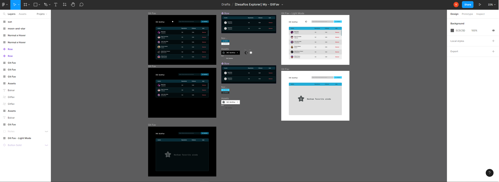

  

# GitFav

 

**Application that list only your favorite GitHub profiles at your choice!**

---

	<a href="#about">About</a> •
  <a href="#preview">Preview</a> •
	<a href="#tech-stack">Tech Stack</a> •
  <a href="#functionalities">Functionalities</a> •
	<a href="#publication">Publication</a> •
	<a href="#author">Author</a> 

---

## About

GitFav is an application wich you can favorite GitHub users, after a briefly search by their username.

Project developed as an apprentice exercise during Stage 06 of Rocketseat's learning "Trilha Explorer".

The project concept intends to give some practice and learning about:

- Tables in HTML and CSS;
- Accessibility -> SR-only (screen reader only) CSS class;
- Using external APIs in an application;
- JSON;
- OOP -> Object Oriented Programming and it's principles;

  - Inheritance;
  - Polymorphism;
  - Encapsulation;
  - Abstraction;

- Classes and objects;
- Functional programming -> Immutability;
- Browser localStorage usage and application;
- JavaScript - Asynchronous and promises -> Async/ await;
- Control flow and error handling -> Try/ Catch/ Throw.

## Preview

<h1 align="center">
    
</h1>

### Using FIGMA

To reach this layout, based on the original project of _Daniel Duarte_, provided by Rocketseat, I used FIGMA:

 

   
Click here for an image preview and also access the project

    
   

 

## Tech Stack

 
  
  
  
  
  
  

## Functionalities

- Responsive -> Access this by Desktop or mobile;
- Modes -> Choose beteween dark e light;
- Search engine -> Find GitHub users by their username;
- Having a search match, you will see:

  - The user profile picture, name and username;
  - The number of repositories, and;
  - The number of followers it have.

- Keyboard navigation -> Press ENTER to favorite the ones you like most;
- Table display -> All the choosen repositories will be disposed in a list;
- Stylized scrollbar (Chrome and Mozilla Firefox) -> Browse the list;
- Remove button -> Remove the users you want;
- Add them again to the list at any time.

## Publication

 

To view that project published:

> [GitFav](https://macedovin.github.io/GitFavorites/) your favorite GitHub users!

or

> Clone this repository!

## Author

 

Projeto criado pela [Rocketseat](https://github.com/Rocketseat) e desenvolvido por [Vinicius&nbsp;Macedo](https://github.com/Macedovin).

&nbsp;
&nbsp;

 
